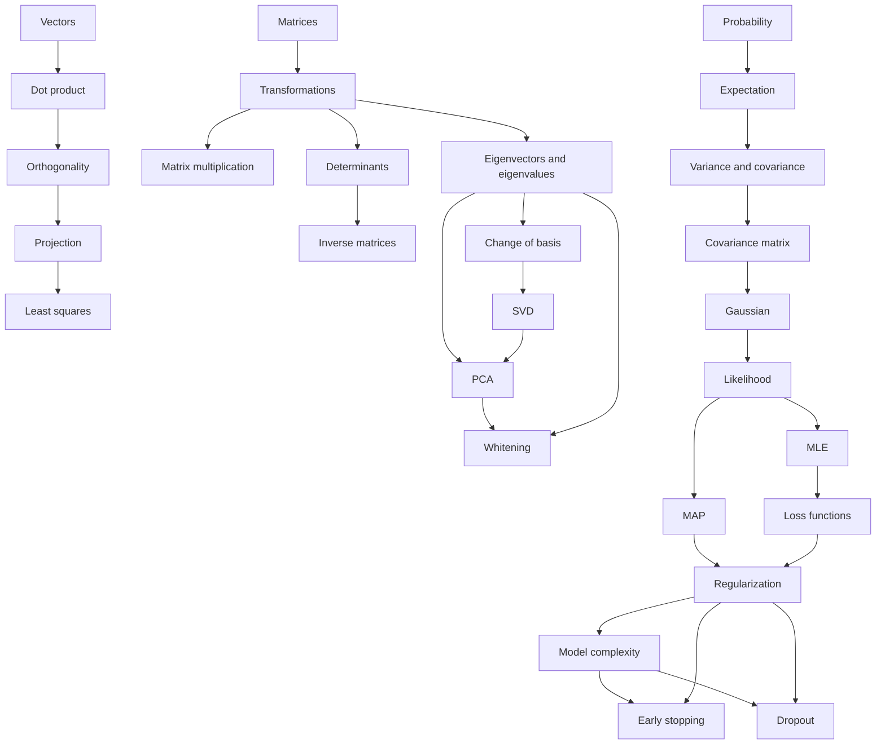

# Concept Graph

## How To Use This Graph

Before reviewing a lesson, find the lesson's main concept and trace backward until every prerequisite feels familiar. Then trace forward to see why the concept matters later. If a node feels fuzzy, review the reference document for that node before opening the full transcript.

## Curriculum Dependency Graph

## Review Strategy

- If the lesson is algebra-heavy, identify the invariant first.
- If the lesson is notation-heavy, open `reference/symbol-table.md` before reading.
- If the lesson is probabilistic, write the assumptions table before manipulating formulas.
- If a result feels memorized, check `reference/derivation-index.md` and reconstruct it.
